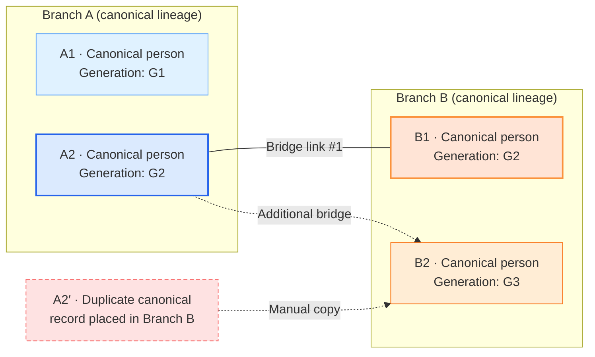

## Branch Bridging Diagrams

The following Mermaid diagrams compare today’s flexible bridge model with the proposed stricter approach.

### Current Bridging Behaviour



### Proposed Stricter Bridging Behaviour

```mermaid
graph LR
    %% Canonical ownership per branch
    subgraph Branch_A_new["Branch A (canonical)"]
        A1_new["A1 · Canonical person<br/>Home generation G1"]
    end

    subgraph Branch_B_new["Branch B (canonical)"]
        B1_new["B1 · Canonical person<br/>Home generation G3"]
    end

    %% Single primary bridge
    A1_new ==>|"Primary bridge (approved)"| B1_new

    %% Visual override node inside Branch A
    A1_display["Bridge node in Branch A<br/>Displayed generation override G3"]

    %% Bridge metadata
    B1_new -. carries override .-> A1_display

    %% Constraints
    classDef primaryBridge stroke:#facc15,stroke-width:3px,stroke-dasharray:2 4,fill:#fef08a;
    classDef canonical stroke:#1e3a8a,stroke-width:2px,fill:#dbeafe;
    classDef displayNode stroke:#d97706,stroke-width:2px,stroke-dasharray:4 4,fill:#fef3c7;

    class A1_new,B1_new canonical
    class A1_display primaryBridge,displayNode

    %% Notes
    A1_display:::displayNode
    note right of A1_display
        • Exactly one primary bridge per branch pair
        • Bridge stores display_generation_override
        • No duplicate canonical person records
        • Supporting links require demotion/rejection first
    end note
```
